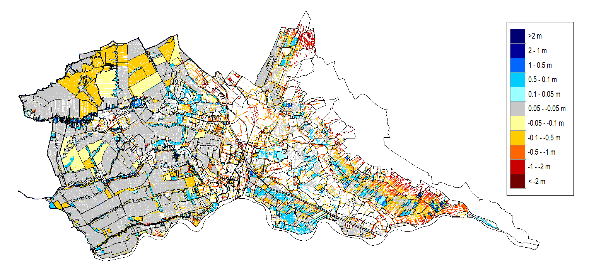
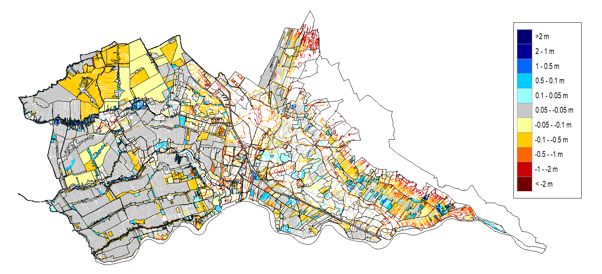
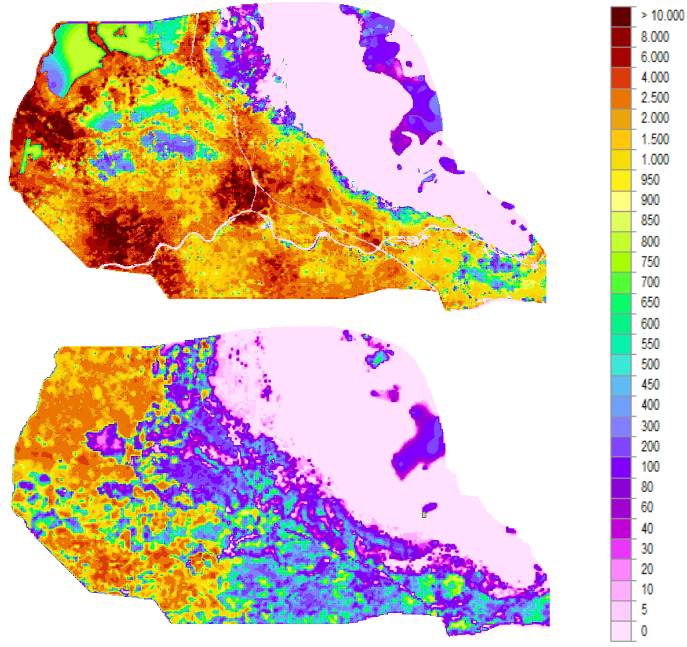

# Resultaten Hydromedah model

##Resultaat aangepaste peilgebieden

De peilgebieden zijn aangepast zoals beschreven in het Python notebook. 
In figuur 1 en 2 worden de verschilkaarten weergegeven, waarbij respectievelijk het nieuwe winterpeil minus het Hydromedah winterpeil en het nieuwe zomerpeil minus het Hydromedah zomerpeil worden getoond. Uit deze figuren blijkt dat de peilen over het algemeen zijn verlaagd.

In figuur 1 en 2 zie je verschilkaarten tussen respectievelijk het nieuwe winterpeil minus het Hydromedah winterpeil en het nieuwe zomerpeil minus het Hydromedah zomerpeil. Uit deze figuren blijkt dat de peilen over het algemeen verlaagd zijn. 

Figuur 1: Verschil nieuw winterpeil minus Hydromedah winterpeil [m] 

Figuur 2: Verschil nieuw zomerpeil minus Hydromedah zomerpeil [m]

##Resultaat aangepaste deklaagweerstand 
Zoals te zien is in de figuur zijn de weerstanden in het LHM in veel gebieden veel hoger dan de weerstand in het LHM. 

Figuur 3: Weerstand deklaag [dag] in Hydromedah (bovenste figuur) en LHM (onderste figuur)